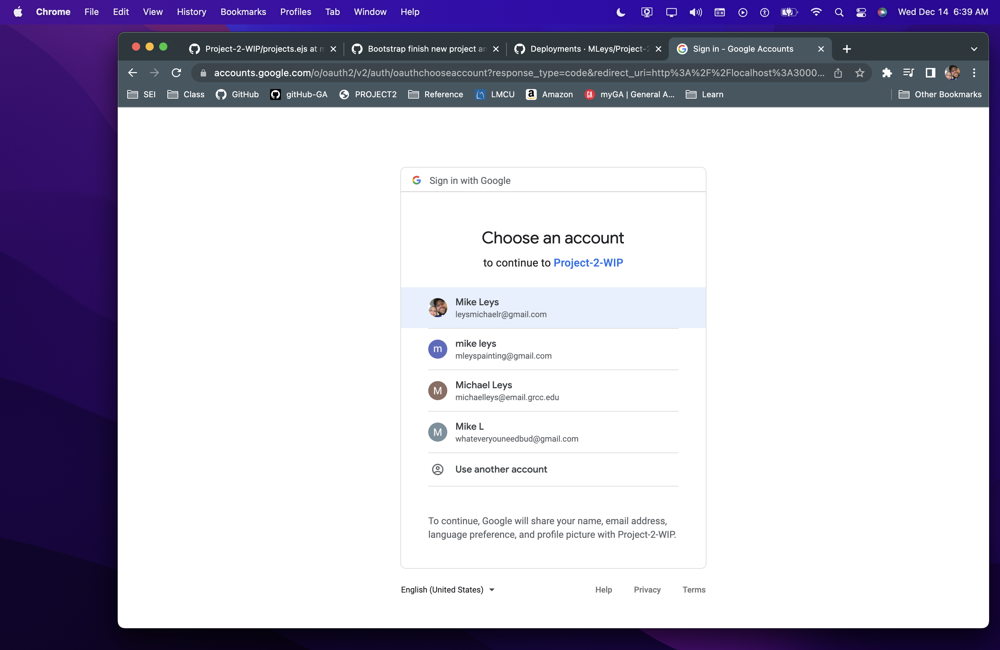

Welcome to Layers!

Keep track of teams and progress

Created using HTML, CSS, and JavaScript, espress, mongoose, mongoDb, node.js

    
    
    
    
    
    

-Player starts with $100 balance. 
-Select chip denomination you would like to bet.
-Click on respective bet buttons to place bets.
-When finished, press SPIN to see what number is spun!
-Click 'X' in top right corner to close and return to game.
-Player can clear all current bets by pressing the 'reset' button.
-Winnings (if any) are automatically added to players credits.

Play here --> https://mleys.github.io/Project-1-Roulette/

Future Development:
-More user interface with current bets
-Ability to calculate chances of winning based on bets
-Visual stacking of chips on bets
-Increased bet options to play corners, rows, ect.
-Live animation of wheel spin
-Winning number represented on board better against other bets
-Table cleared after spin and payouts per bet listed to player
-and more!

